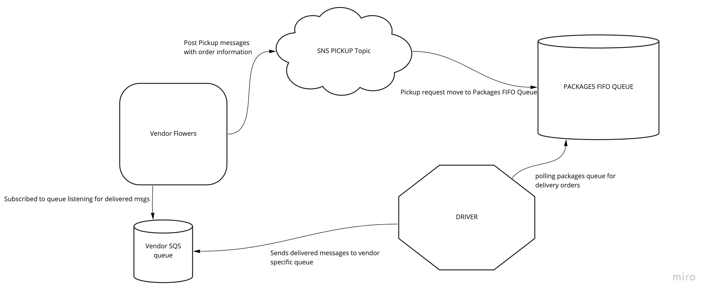
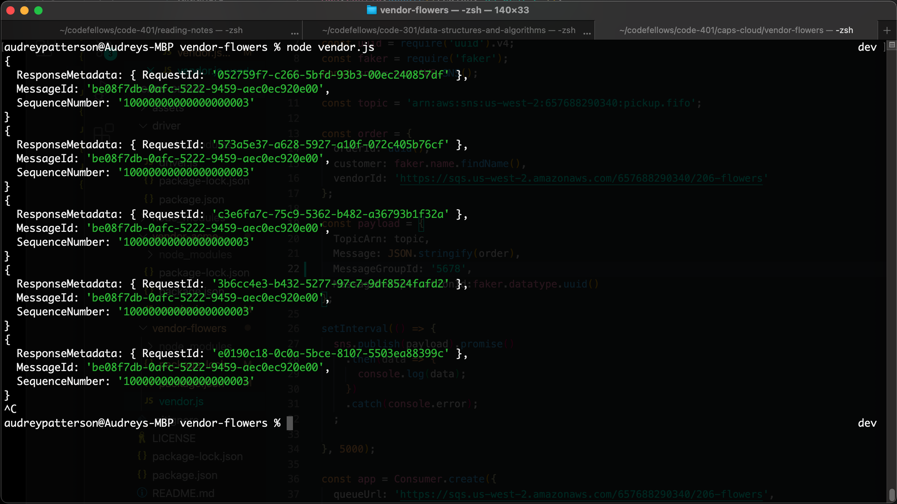
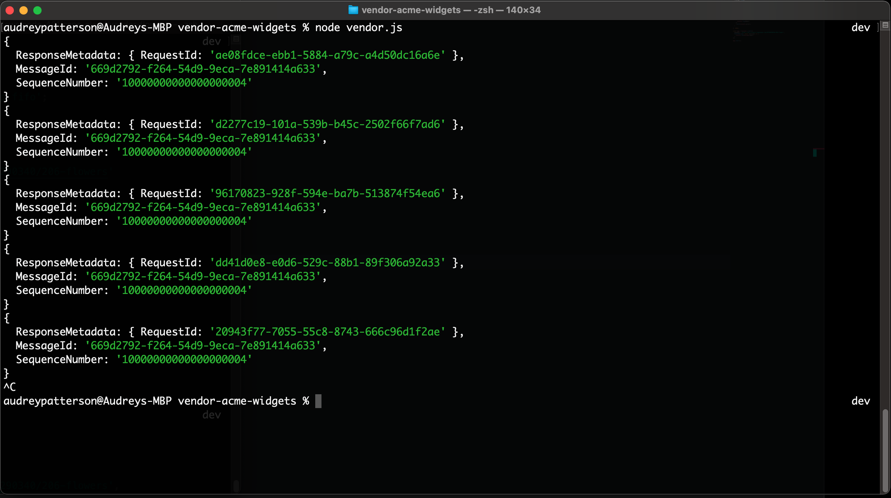
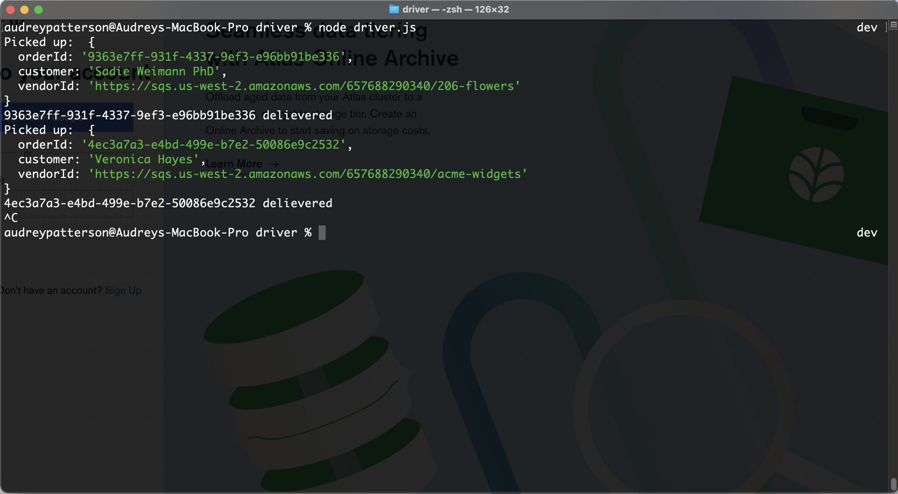

# Lab: Class 19

## Project: caps-cloud

### Author: Audrey Patterson

### Feature Task

- Required Services
  - SNS Topic: pickup which will receive all pickup requests from vendors
  - SQS Queue (FIFO): packages which will contain all delivery requests from vendors, in order of receipt.
  - Subscribe this queue to the pickup topic so all pickups are ordered
  - SQS Queue (Standard) for each vendor (named for the vendor) which will contain all delivery notifications from the drivers

## Pull Request

- [Pull Request dev to main](https://github.com/arpatterson31/caps-cloud/pull/1)

## Starting the process

`node vendor.js`
`node driver.js`

## UML Diagram

## Console Screenshots of vendors and drivers

1. Vendor - 206-Flowers

2. Vendor - Acme Widgets

3. Driver

